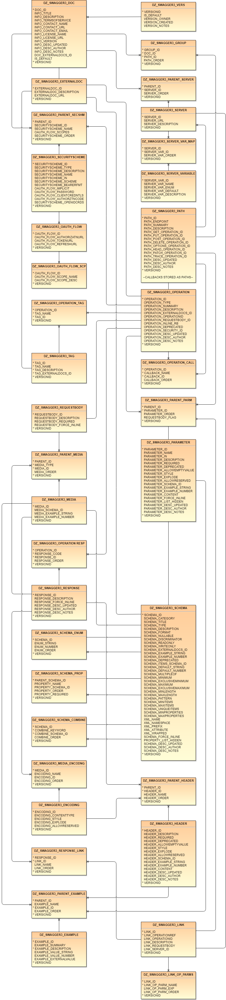

# DZ_SWAGGER3
PLSQL module for the creation, storage, production and validation of Open API 3.0 service definitions.  This code is a rewrite of the existing DZ_SWAGGER project which uses the now defunct 2.0 specification.

Oracle mod_plsql and APEX allow for the exposure as services of as many parameters and data elements that you have procedures and tables to produce.  A complex dataset may generates hundreds - even thousands - of often changing inputs and outputs for which users must track and comprehend to consume the service.  Using the [OpenAPI (Swagger) specification](http://swagger.io/specification), a given set of service's details may be documented and published using JSON or YAML documents.  However managing and generating such documentation may be a large undertaking when the underlying services are ever-expanding and ever-changing.  As a new service comes online it may use some or even most of the components of existing services.  This then leads to copy-and-paste nightmares as common elements are updated in one specification and not in others.

Generally the approach is something along the lines of [SwaggerHub](https://app.swaggerhub.com) which provides a solid and powerful platform for managing, versioning and publishing specifications.  However, it still can be challenging when a universe of swagger elements needs to be sliced and diced on the fly into different specifications with some elements in common and other separate.

DZ_SWAGGER3 is thus a set of tabular resources to store Open API elements and a set of logic to generate Swagger specifications from the table.  One item missing is the logic to take an existing 3.0 specification document and unload it into the tables.  

For details on recents updates, see the [change log](/CHANGELOG.md).

## Sample Data
A rough sample dataset is provided for testing and evaluation.  The sample was developed to test the rarer OpenAPI scenarios and could be improved with more functional examples.

## Usage
DZ_SWAGGER3 uses Oracle types to encapsulate the serialization logic.  The top level type is DZ_SWAGGER3_TYP and almost certainly where you'd want to tie into your specification handling.  To fetch all elements of the sample dataset as a single OpenAPI document:

```
DECLARE
   clb_output CLOB;
BEGIN
   clb_output := dz_swagger3_typ(
       p_doc_id    => 'SAMPLE'
      ,p_group_id  => 'SAMPLE'
      ,p_versionid => 'SAMPLE'
   ).toJSON();
   -- Do something with the clob --
END;
/
```
or if YAML is desired
```
DECLARE
   clb_output CLOB;
BEGIN
   clb_output := dz_swagger3_typ(
       p_doc_id    => 'SAMPLE'
      ,p_group_id  => 'SAMPLE'
      ,p_versionid => 'SAMPLE'
   ).toYAML();
END;
/
```

## Data Model


## JSON Schema extension
As OpenAPI properties are a superset of JSON Schema, one would think flipping between OpenAPI and JSON Schema **should** be pretty simple.  However there is really nothing out there for doing the swap nor guidance for the conversion.  As its mostly a matter of removing OpenAPI specific elements from the definition output, the project includes logic to output JSON Schema by endpoint and method:

```
DECLARE
   clb_output CLOB;
BEGIN
   clb_output := dz_swagger3_jsonsch_typ(
       p_path_id        => 'NavigationServiceGeoJSON'
      ,p_http_method    => 'get'
      ,p_response_code  => 'default'
      ,p_media_type     => 'application/json'
      ,p_versionid      => 'SAMPLE'
   ).toJSON();
END;
/
```

## Mock Service extension
OpenAPI provides structures for persisting example values for both input and output.  Thus a variety of products will take an OpenAPI path endpoint and output a generic "mocked" emulation of what real output should look like.  DZ_SWAGGER3 provides a basic form of this via the mocksrv object:

```
DECLARE
   clb_output CLOB;
BEGIN
   clb_output := dz_swagger3_mocksrv_typ(
       p_path_id        => 'Sample.Streamcat'
      ,p_http_method    => 'post'
      ,p_response_code  => 'default'
      ,p_media_type     => 'application/json'
      ,p_versionid      => 'SAMPLE'
   ).toMockJSON();
END;
/
```

or mock the service as XML

```
DECLARE
   clb_output CLOB;
BEGIN
   clb_output := dz_swagger3_mocksrv_typ(
       p_path_id        => 'Sample.Streamcat'
      ,p_http_method    => 'post'
      ,p_response_code  => 'default'
      ,p_media_type     => 'application/xml'
      ,p_versionid      => 'SAMPLE'
   ).toMockXML();
END;
/
```

OpenAPI 3.0 examples are rather complicated and will undergo improvements with 3.1 to make them the same as modern JSON Schema.  The current DZ_SWAGGER3 mock server renderer only works with scalar example values tied directly to the schema record (in the DZ_SWAGGER3_SCHEMA table).  At this time it does not render the more complicated [examples](https://swagger.io/docs/specification/adding-examples/) definitions stored in the DZ_SWAGGER3_EXAMPLE table. 

DZ_SWAGGER3 also supports the generation of XML mocked services if the endpoint has application/xml loaded as a media type.  But the code is not optimized as the current manner of lazy-loading each node level whilst walking the object tree does not fit well with the needs of XML renderering in OpenAPI.  It does work but the logic is convoluted as each XML node must cast forward in the object tree to sniff for situations where child elements need to be moved onto the XML node as attributes.  This points to a rigidity in the current logic that could use some improvement. 

## OpenAPI results validation
Both DZ_SWAGGER3 and DZ_SWAGGER are completely capable of creating an invalid OpenAPI document.  While constraints and triggers are provided to help keep things in order as best as possible, determining the final, ultimate validity of a given document is not so easy from the PLSQL perspective.

The DZ_SWAGGER3_VALIDATION package attempts to provide several forms of validation for users in an à la carte fashion:

1. **No Validation**: If the folks creating the DZ_SWAGGER3 data records for your endpoints are conscientious hard-workers who frequently spot-check their results in [Swagger Editor](https://editor.swagger.io/), well then perhaps you can just forgo validation and hope for the best.
2. **PLSQL Validation**: PLSQL-based validation is more of a proposal than a reality for now.  Basically we can build PLSQL tools in the DZ_SWAGGER3_VALIDATION package to test and proof an OpenAPI 3.x document.  At least for now on 18c there is little provided by Oracle to help with this task.  It becomes problematic when we need to fetch external references.  I have mulled if things like the new Javascript engine and other enhancements to the new binary JSON object on 21c might make this easier down-the-line.
3. **External Badge Validation**: An easier solution would be to simply call out to an [service](https://github.com/swagger-api/validator-badge) to test validity.  In fact that is what the Swagger-UI does each time you view a document and receive that small green "valid" badge in the lower corner.  Though while a more powerful solution, convincing your DBAs to agree to allow service calls (via ACLs and an Oracle Wallet) to a foreign or internally-hosted service may or may not be a viable solution in your environment.
4. **Other OpenAPI Validators**: seeking other solution beyond the badge server is... well sparse in 2021.  [speccy](https://github.com/wework/speccy) seems like a good option but the project has been ominously quiet for over a year.  Its also not provided as a service but rather as a command line tool.  If you have other suggestions please submit them as an enhancement issue.

One item to note is that the Smart Bear [Swagger Editor](https://editor.swagger.io/) validation *is not* the same as the validation logic located in the badge validator.  They are different things with the former logic in JavaScript and the latter logic in Java.  Smart Bear [has declined](https://github.com/swagger-api/swagger-editor/issues/2036) to make the validation engine in the editor a separate component that could be encapsulated as a service.  The general hubbub in the two project issues seems to imply the editor is superior or perhaps more robustly maintained.  However, I found the opposite in that my samples contained a problem with the security scopes that the editor missed and the badge validator caught.

The main DZ_SWAGGER3_TYP type has a hook into the validation.

```
DECLARE
   clb_output CLOB;
BEGIN
   clb_output := dz_swagger3_typ(
       p_doc_id    => 'SAMPLE'
      ,p_group_id  => 'SAMPLE'
      ,p_versionid => 'SAMPLE'
   ).validity(
      p_options    => '{"tests":["plsql","swagger_badge"]}'
   );
   -- Do something with the results --
END;
/
```

Ideally your harvesting routine would sniff the results and notify you in some reasonable manner if the valid attribute is false.

## Post Parameter RequestBody extension
OpenAPI 3.0 provides new structures for post operations via the new RequestBody component.  However some of us remain stuck on our old middleware systems whereby posts are little but form reflections of get parameters.  When get and post are mirrors of each other it is rather onerous to maintain parallel structures and descriptions via parameters and request bodies.

DZ_SWAGGER3 includes the option to tag parameters under a post as comprising a flat schema of schemas which is generated on-the-fly from parameter components and output in the document as a request body.

## Loading Existing Swagger Specifications into DZ_SWAGGER3
As mentioned above the only workflow to add a specification to DZ_SWAGGER3 is to load each table with the needed elements by hand.  As this involves understanding the data model and quite a bit of up-front work you may not find DZ_SWAGGER3 of much utility.  I plan to tackle the issue of importing data in a future 2021 release.

## Installation
The host schema needs to have CREATE VIEW permissions and storage permissions on a tablespace.  Execute the deploy sql using the Oracle client of your choice.  DZ_SWAGGER3 tables will be created in the host schema if they do not already exist.  Generally the assumption is you manage the specification with the host schema and generate the specifications using any schema (via AUTHID CURRENT_USER).

### Docker

Oracle has gradually made Docker deployment of XE far easier than in the past.  At this point we can somewhat assume that docker users should or could have an XE image handy.  Basically the steps to get there are to clone the [official Oracle docker repository](https://github.com/oracle/docker-images) and execute the container builder script

```
docker-images/OracleDatabase/SingleInstance/dockerfiles/buildContainerImage.sh -v 18.4.0 -x
```

This works just fine on Windows using the bash shell provided with GitHub for desktop.  Again amazingly there is nothing to agree to or download separately, the script just runa and just works.  With oracle/database:18.4.0-xe then in your images, you can use docker-compose to quick create a working example of DZ_SWAGGER3 in XE with a companion badge validator server.

## Collaboration
Forks and pulls are **most** welcome.  The deployment script and deployment documentation files in the repository root are generated by my [build system](https://github.com/pauldzy/Speculative_PLSQL_CI) which obviously you do not have.  You can just ignore those files and when I merge your pulls my system will autogenerate updated files for GitHub.

[](https://creativecommons.org/publicdomain/zero/1.0/)

