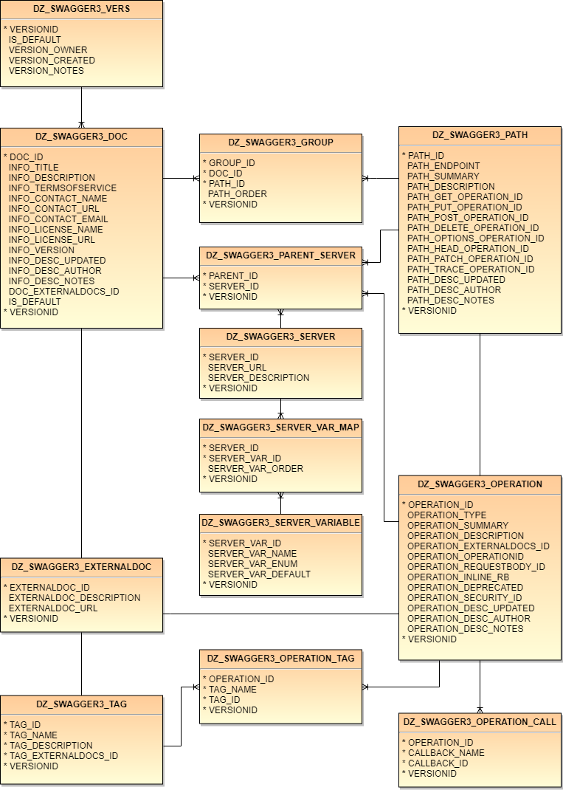
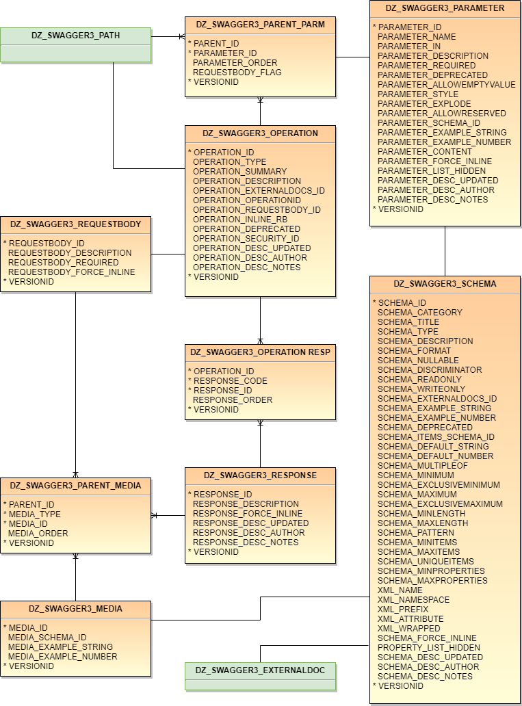
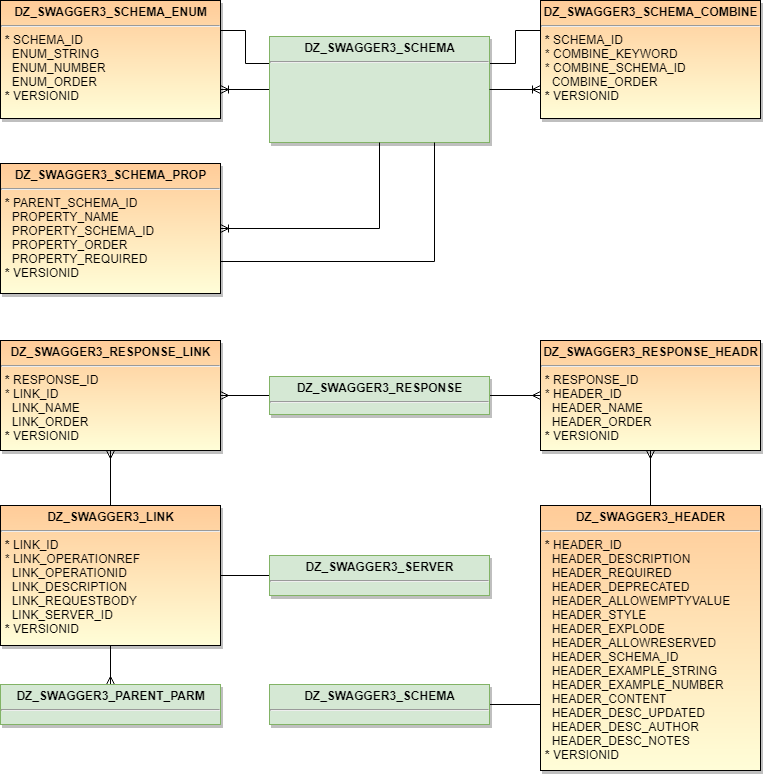

# DZ_SWAGGER3
PLSQL module for the creation, storage and production of Open API 3.0 service definitions.  This code is rewrite of the existing DZ_SWAGGER project which uses the now defunct 2.0 specification.

Oracle mod_plsql and APEX allow for the exposure as services of as many parameters and data elements that you have procedures and tables to produce.  A complex dataset may generates hundreds - even thousands - of often changing inputs and outputs for which users must track and comprehend to consume the service.  Using the [OpenAPI (Swagger) specification](http://swagger.io/specification), service details may be documented and published using JSON or YAML documents.  However managing and generating such documentation may be a large undertaking when the underlying services are ever-expanding and ever-changing.  As a new service comes online it may use some or even most of the components of existing services.  This then leads to copy-and-paste nightmares as common elements are updated in one specification and not in others.

Generally the approach is something along the lines of [SwaggerHub](https://app.swaggerhub.com) which provides a solid and powerful platform for managing, versioning and publishing specifications.  However, it still can be challenging when a universe of swagger elements needs to be sliced and diced on the fly into different specifications with some elements in common and other separate.

DZ_SWAGGER3 is thus a set of tabular resources to store Open API elements and a set of logic to generate Swagger specifications from the table.  The one item missing is the logic to take an existing 3.0 specification and unload it into the tables.  

## Sample Data
Sample data is under construction

## Usage
DZ_SWAGGER3 uses Oracle types to encapsulate the serialization logic.  As these are database types they may be invoked directly from SQL.  The top level type is DZ_SWAGGER3_TYP and almost certainly where you'd want to tie into your specification handling.  To simply fetch all elements of my sample dataset as a single unified definition:

```
DECLARE
   clb_output CLOB;
BEGIN
   clb_output := dz_swagger3_typ(
       p_header_id => 'WATERS'
      ,p_versionid => 'SAMPLE'
   ).toJSON();
   -- Do something with the clob --
END;
/
```
or to produce pretty printed JSON
```
DECLARE
   clb_output CLOB;
BEGIN
   clb_output := dz_swagger3_typ(
       p_header_id => 'WATERS'
      ,p_versionid => 'SAMPLE'
   ).toJSON(
      p_pretty_print => 0
   );
END;
/
```
or if YAML is desired
```
DECLARE
   clb_output CLOB;
BEGIN
   clb_output := dz_swagger3_typ(
       p_header_id => 'WATERS'
      ,p_versionid => 'SAMPLE'
   ).toYAML();
END;
/
```

## Data Model

___


___



## JSON Schema extension
As Swagger properties are a superset of JSON Schema, one would think flipping between and Swagger and JSON Schema **should** be pretty simple.  However there is really nothing out there for doing the swap nor guidance for the conversion.  As its mostly a matter of removing Swagger elements from the definition output, the project includes logic to output JSON Schema by endpoint and method:

```
DECLARE
   clb_output CLOB;
BEGIN
   clb_output := dz_swagger3_jsonsch_typ(
       p_path_id        => 'NavigationServiceGeoJSON'
      ,p_http_method    => 'get'
      ,p_response_code  => 'default'
      ,p_media_type     => 'application/json'
      ,p_versionid      => 'SAMPLE'
   ).toJSON(0);
END;
/
```

## Post Parameter RequestBody extension
OpenAPI 3.0 bravely moves into the world of complex JSON input for post operations via the new Request Body component.  However some of us remain stuck on our old middleware where posts are little but form reflections of get parameters.  When get and post are mirrors of each other it is rather onerous to maintain parallel structures and descriptions in parameters and request bodies.

DZ_SWAGGER3 includes the option to tag parameters under a post as comprising a flat schema of schemas which is generated on-the-fly from parameter components and output in the document as a request body.

## Loading Existing Swagger Specifications into DZ_SWAGGER3
As mentioned above the only workflow to add a specification to DZ_SWAGGER3 is to load each table with the needed elements by hand.  As this involves understanding the data model and quite a bit of up-front work you may not find DZ_SWAGGER3 of much utility.  I continue to ponder ideas of how to unload existing specifications into Oracle.  I am always interested in your suggestions. 

## Installation
DZ_SWAGGER3 is dependent on the [DZ_JSON](https://github.com/pauldzy/DZ_JSON) module.  The host schema needs to have CREATE VIEW permissions and storage permissions on a tablespace.  First install DZ_JSON and then secondly install DZ_SWAGGER3.  DZ_SWAGGER3 tables will be created if they do not already exist.  Generally the assumption is you manage the specification with the host schema and generate the specifications using any schema (via AUTHID CURRENT_USER).

## Collaboration
Forks and pulls are **most** welcome.  The deployment script and deployment documentation files in the repository root are generated by my [build system](https://github.com/pauldzy/Speculative_PLSQL_CI) which obviously you do not have.  You can just ignore those files and when I merge your pulls my system will autogenerate updated files for GitHub.

